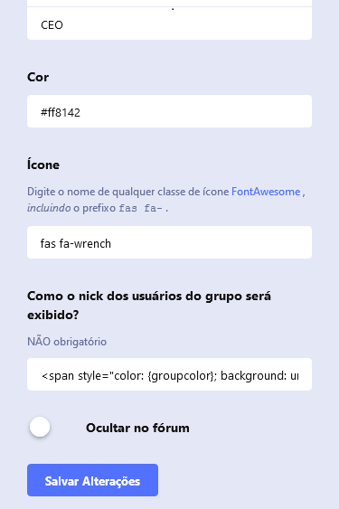

## Prints
Admin panel (group edit):

Forum (discussions):

## How to add it to your Flarum Forum
**Note:** before run these commands, make sure you have PHP and Composer installed

1. Open the terminal of your choice
2. Run this command: `composer require davidnery/nickname-group-formatter`
3. Enable the extension in the extensions panel
4. Configure the format of the groups in the group edit panel
